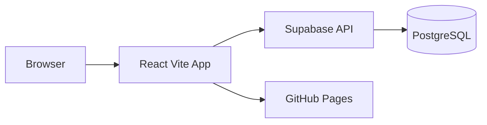
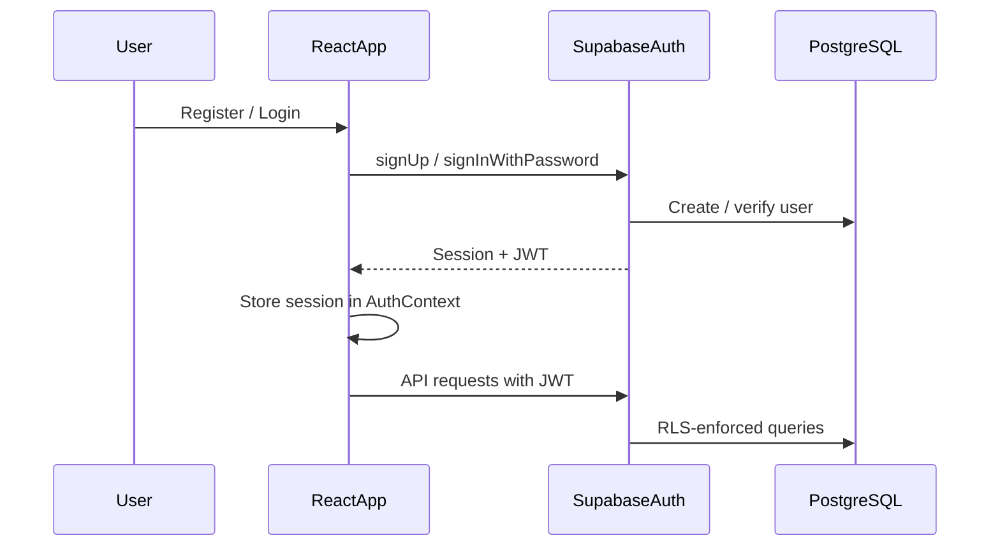

# Architecture

Technical reference for Chroniqe. For full product specifications, refer to the local design documents.

## High-Level Data Flow



1. The React SPA runs in the browser and communicates with Supabase via the JavaScript client.
2. Supabase handles authentication, validates requests, and enforces Row Level Security (RLS).
3. PostgreSQL stores user data. The anon key is safe for client use because RLS restricts access per user.
4. Static assets are served from GitHub Pages.

## Database Schema

### MVP Tables

#### `profiles`

Extends Supabase `auth.users` with public profile data.

| Column | Type | Notes |
|--------|------|-------|
| `id` | `uuid` | PK, references `auth.users(id)` |
| `username` | `text` | Unique display name |
| `avatar_url` | `text` | Optional profile image URL |
| `created_at` | `timestamptz` | Default `now()` |

#### `lists`

User-owned tracking lists.

| Column | Type | Notes |
|--------|------|-------|
| `id` | `uuid` | PK, default `gen_random_uuid()` |
| `user_id` | `uuid` | FK → `profiles(id)` |
| `title` | `text` | List name |
| `icon` | `text` | Optional emoji or icon identifier |
| `created_at` | `timestamptz` | Default `now()` |

#### `items`

Entries within a list.

| Column | Type | Notes |
|--------|------|-------|
| `id` | `uuid` | PK, default `gen_random_uuid()` |
| `list_id` | `uuid` | FK → `lists(id)` |
| `title` | `text` | Item name |
| `description` | `text` | Optional summary |
| `status` | `text` | `planned`, `in_progress`, `completed`, `dropped` |
| `rating` | `smallint` | 1–10, nullable |
| `note` | `text` | Personal notes |
| `event_date` | `date` | When watched/played/read |
| `created_at` | `timestamptz` | Default `now()` |

### Future Tables

- `tags` — item categorization
- `friendships` — social connections
- `activity_logs` — audit and feed data

Migrations will be added in Phase 3 under `supabase/migrations/`.

## Authentication Flow



1. User submits credentials on Login or Register page.
2. Supabase Auth returns a session with a JWT.
3. `AuthContext` holds the session and exposes `user` / `loading` state.
4. All data requests include the JWT; RLS policies ensure users only access their own rows.
5. Logout clears the session client-side and invalidates the token server-side.

## Security

| Concern | Approach |
|---------|----------|
| **Row Level Security** | Every table enforces `user_id = auth.uid()` (or equivalent via joins) |
| **Anon key** | Public client key; safe because RLS blocks unauthorized reads/writes |
| **Service role key** | Never exposed to the client; server-side only |
| **Input validation** | Client-side validation for UX; database constraints and RLS for enforcement |
| **Secrets** | `.env` files are gitignored; only `.env.example` is committed |

## UI Page Map

| Route | Page | Auth Required | Description |
|-------|------|---------------|-------------|
| `/` | Landing | No | Marketing / entry point |
| `/login` | Login | No | Sign in form |
| `/register` | Register | No | Sign up form |
| `/dashboard` | Dashboard | Yes* | Activity overview |
| `/lists` | Lists | Yes* | All user lists |
| `/lists/:id` | List Detail | Yes* | Items in a single list |
| `/profile` | Profile | Yes* | User profile |
| `/settings` | Settings | Yes* | App preferences |

\* Auth guards will be added in Phase 4. Routes are currently accessible without login for development.

### Layout Structure

```
AppLayout
├── Navbar (top bar, logo, quick links)
├── Sidebar (navigation: Dashboard, Lists, Profile, Settings)
└── <Outlet /> (page content)
```

Public pages (Landing, Login, Register) render outside `AppLayout`.

## Related Documentation

- [README.md](../README.md) — Setup and overview
- [ROADMAP.md](../ROADMAP.md) — Development phases
- [CONTRIBUTING.md](../CONTRIBUTING.md) — Contribution guidelines
- [supabase/README.md](../supabase/README.md) — Database migrations (Phase 3)
